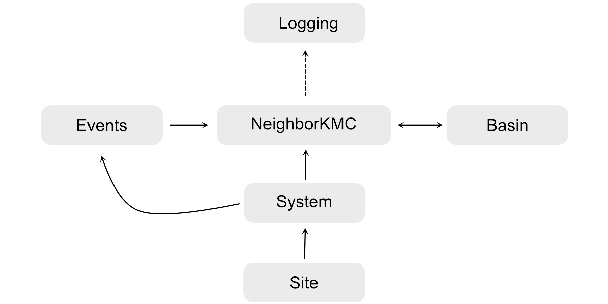

.. _structure:
.. index:: Structure 

Structure of modules
*********************

:program:`MonteCoffee` is written using `object-oriented <https://docs.python.org/3/tutorial/classes.html>`_ programming.
The central modules are defined as shown in the figure below:

The modules have different functions:
    - **Site**: Defines a catalytic site with properties such as site-type, coordination numbers, and nearest neighbors.
    - **System**: Defines the collection of catalytic sites.
    - **Events**: Defines the possible events in the simulation, and their rate constants.
    - **NeighborKMC**: Controls the actual simulation. Therefore, it is the central object of the simulation.
    - **Basin**: Defines the acceleration in the simulation based on rates. (N.B., in the journal article `M. Jørgensen and H. Grönbeck J. Chem. Phys. 149, 114101 (2018) <https://doi.org/10.1063/1.5046635>`_ this module belonged to NeighborKMC, but it was later separated as the program grew.)
    - **Logging**: Handles logging of simulation by receiving input from `NeighborKMC`.

The site-connectivity is defined by each site's neighborlist. The set of neighborlists for all sites defines a global
connectivity pattern.

For more information about the classes, modules, and methods, please see :ref:`api`. The API is vital as :program:`MonteCoffee` is 
designed as a programmable application. Thus, the user downloads the modules and prepares a simulation by making changes to the files
named user_*.py.

